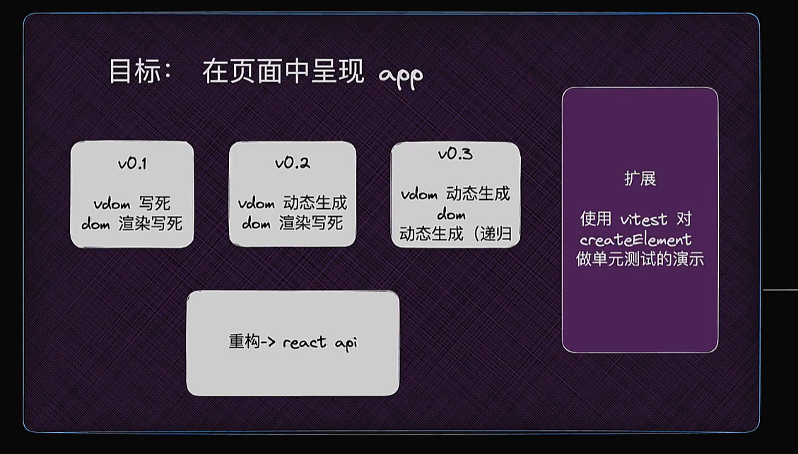
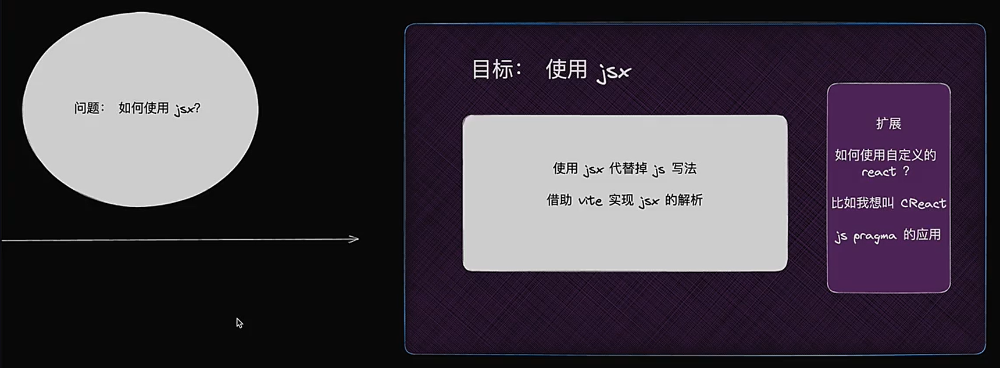

# mini-react

## 前言

本项目是一个实践项目，源于催学社的“mini-react 游戏副本”，课程链接：https://nkunu.xetlk.com/s/F6z9B

学习痛点：

- 收藏夹里吃灰；
- 只看不动手；
- 遇到问题卡住了，直接放弃；
- 跟着视频边看边敲，没明白，不会举一反三；
- 看完完事，没有输出，没有写文章的习惯；
- 学习动力不足；
- 没有志同道合的伙伴一起学习；

科学的学习方式：

- 明确目标，学习路径清晰；
- 任务足够小；
- 有正向反馈；
- 会主动思考；
- 有输出；
- 遇到问题，有人指导；
- 好的学习氛围（环境）；
- 有志同道合的伙伴共同做一件事；

## 副本 Boss：Mini React

这是一个由 300 多行代码实现的 Mini React Boss，这个 Boss 将考验你的技能，包含了丰富的功能和技术挑战：

### 功能

- Function Component
- useEffect
- useState
- 点击事件处理

### 技术挑战

- 递归实现
- 任务调度器（分帧运算）
- Fiber 架构（树结构到链表结构的转换）
- Reconcile（创建、更新、删除）
- Commit 阶段
- 等等

## 副本掉落

成功击败 Mini React Boss，你将得到以下宝贵的掉落：

- React 经验 +1000
  - 驾驭上层应用更加得心应手
- 数据结构和算法 +1000
- JavaScript 经验 +1000
- 一群志同道合的伙伴
- xx 元催学社专属优惠券
- 抽奖机会

## 副本玩法

- 将大任务拆解为小任务，确保清晰的学习路径；
- 通过问题驱动，促使主动思考；
- 每天只需击败一个怪物，即完成一个任务，足够简单；
- 每日打卡，输出当天所学和问题的思考笔记；
- 在社群中解决学习中遇到的问题，队长（阿崔）会亲自引导；
- 一群人学习，你不再孤单

## 进入条件

- 熟悉 JavaScript，一年经验即可；
- 使用或了解过 React 的基本用法，无需 React 源码经验；

准备好了吗？让我们开始吧！

## 目标与路径

### 目标一

在页面中呈现 app，要求自己实现的 mini-react API 和 React 的 API 对齐。

### 目标二

使用 jsx

